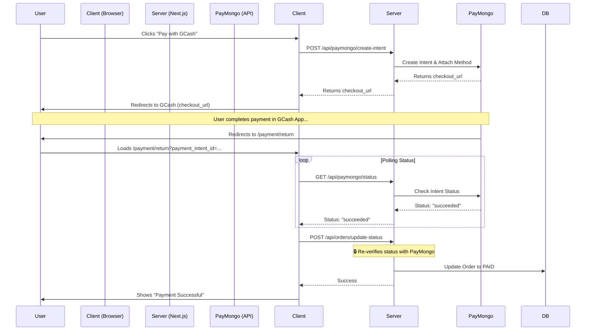

# ✅ GCash Payment Integration - Implementation Summary

## 🚀 Overview: Webhook-Free Architecture

I have implemented a **Webhook-Free GCash Payment System** using PayMongo. This approach is designed for simplicity and reliability, eliminating the need for complex webhook listeners, ngrok tunnels during development, or public-facing callback URLs.

Instead of waiting for asynchronous webhooks, this implementation uses a **Redirect & Poll** strategy:
1.  **Redirect**: The user is redirected to GCash to pay.
2.  **Return**: After payment, they are redirected back to our app.
3.  **Poll/Verify**: The client immediately asks the server to verify the payment status directly with PayMongo.

---

## 📦 Key Components & Files

### **1. Frontend Components**
*   **`components/GcashPayButton.jsx`**
    *   Initiates the payment process.
    *   Calls the create-intent API.
    *   Redirects the user to the PayMongo/GCash checkout URL.
*   **`app/payment/return/page.jsx`**
    *   The landing page after a user completes (or cancels) payment.
    *   Automatically captures the `payment_intent_id` from the URL.
    *   Polls the server to check the final status of the payment.
    *   Displays Success or Failure messages.

### **2. Backend API Routes**
*   **`app/api/paymongo/create-intent/route.js`**
    *   **Action**: Creates a Payment Intent, creates a GCash Payment Method, and attaches them.
    *   **Output**: Returns a `checkout_url` for the frontend to redirect to.
    *   **Security**: Sets the `return_url` to our application's return page.
*   **`app/api/paymongo/status/route.js`**
    *   **Action**: Queries PayMongo API for the status of a specific Payment Intent.
    *   **Use**: Used by the frontend to "poll" for status updates.
*   **`app/api/orders/update-status/route.js`**
    *   **Action**: Finalizes the order in the database.
    *   **Security**: **Crucial Step**. It does *not* trust the client. It takes the ID provided by the client, *re-verifies* it with PayMongo server-side to ensure it is truly `succeeded`, and only then updates the database.

---

## 🔄 The Payment Flow (Step-by-Step)



---

## 💻 Technical Specifications

### **1. Internal API Contracts**

#### **POST** `/api/paymongo/create-intent`
*   **Request Body:**
    ```json
    {
      "amount": 10000, // Amount in centavos (PHP 100.00)
      "description": "Order #12345"
    }
    ```
*   **Response:**
    ```json
    {
      "payment_intent_id": "pi_...",
      "checkout_url": "https://pm.link/..."
    }
    ```

#### **GET** `/api/paymongo/status`
*   **Query Params:** `?intent_id=pi_...`
*   **Response:**
    ```json
    {
      "status": "succeeded" // or "pending", "failed", "awaiting_next_action"
    }
    ```

#### **POST** `/api/orders/update-status`
*   **Request Body:**
    ```json
    {
      "intentId": "pi_...",
      "status": "succeeded"
    }
    ```
*   **Response:**
    ```json
    {
      "success": true,
      "order": { ... } // Updated order object
    }
    ```

### **2. PayMongo API Mapping**

We interact with the following PayMongo V1 endpoints:

| Action | Endpoint | Method | Key Parameters |
| :--- | :--- | :--- | :--- |
| **Create Intent** | `https://api.paymongo.com/v1/payment_intents` | `POST` | `amount`, `payment_method_allowed: ['gcash']` |
| **Create Method** | `https://api.paymongo.com/v1/payment_methods` | `POST` | `type: 'gcash'` |
| **Attach Method** | `https://api.paymongo.com/v1/payment_intents/{id}/attach` | `POST` | `payment_method`, `return_url` |
| **Get Status** | `https://api.paymongo.com/v1/payment_intents/{id}` | `GET` | `id` |

### **3. Database Schema Impact**

When a payment is successful, the following fields in the `Order` model (Prisma) are updated:

| Field | Type | New Value | Description |
| :--- | :--- | :--- | :--- |
| `isPaid` | `Boolean` | `true` | Marks the order as paid. |
| `status` | `Enum` | `PAID` | Updates the order workflow status. |
| `paymentStatus` | `String` | `'paid'` | Internal payment status tracker. |
| `paymentId` | `String` | `pi_...` | Stores the PayMongo Payment Intent ID for reference. |
| `paidAt` | `DateTime` | `Now()` | Timestamp of payment confirmation. |

---

## 🔐 Security Features

Even without webhooks, this system is secure:

1.  **Server-Side Intent Creation**: API keys are never exposed to the client.
2.  **Server-Side Verification**: The `/payment/return` page does not update the database directly. It calls `/api/orders/update-status`.
3.  **Double-Check Mechanism**: The `update-status` endpoint **independently verifies** the payment status with PayMongo before making any changes to the database. A malicious user cannot simply call this API to mark an order as paid without a valid, successful Payment Intent ID.

---

## 🛠️ Setup & Configuration

### **Environment Variables**
Ensure these are set in your `.env` file:

```env
# PayMongo Configuration
PAYMONGO_SECRET_KEY=sk_test_...
PAYMONGO_PUBLIC_KEY=pk_test_... (Optional, if used)

# App URL (Required for redirects)
NEXT_PUBLIC_SITE_URL=http://localhost:3000 
# OR for production: https://your-domain.com
```

### **No Ngrok Needed**
Since we are not using webhooks, you do **not** need to run ngrok or expose your localhost to the internet. The redirect flow works perfectly on `localhost`.

---

## 📋 Testing the Flow

1.  **Add Item**: Add a product to your cart.
2.  **Checkout**: Proceed to checkout and select "GCash".
3.  **Redirect**: You will be taken to the PayMongo test page.
4.  **Authorize**:
    *   For **Success**: Click "Authorize Test Payment".
    *   For **Failure**: Click "Fail Test Payment".
5.  **Return**: You will be redirected back to `/payment/return`.
6.  **Verify**:
    *   **UI**: You should see the Green Success Checkmark.
    *   **Database**: The order status should change to `PAID`.
