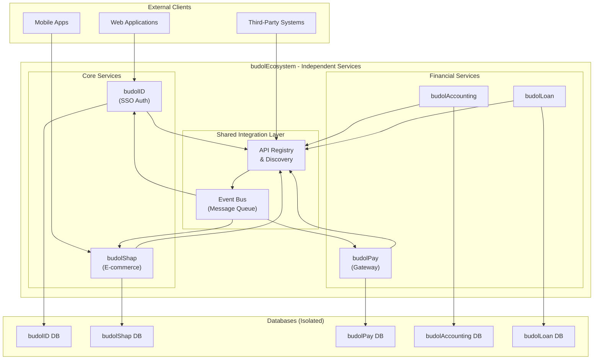
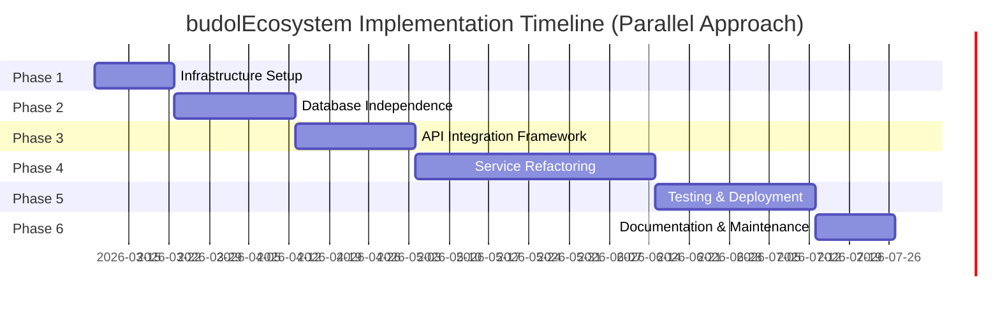
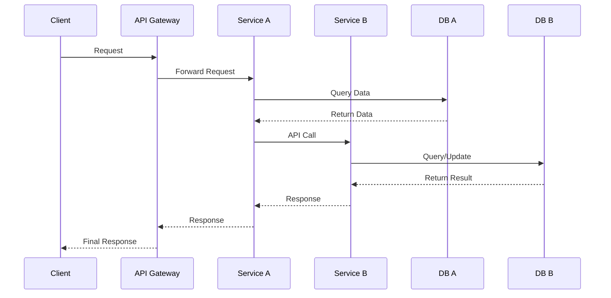
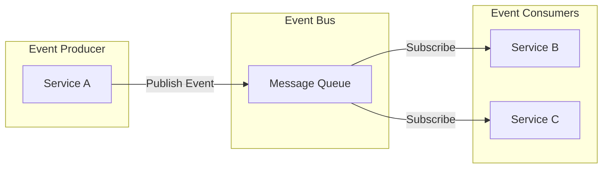
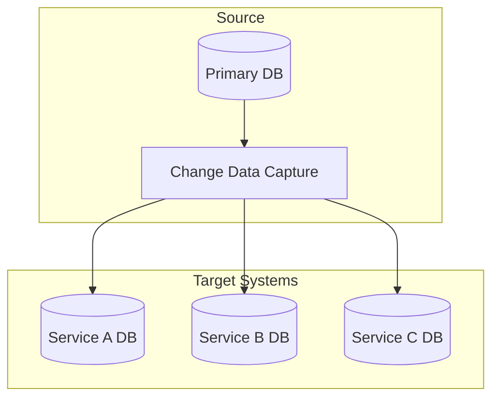
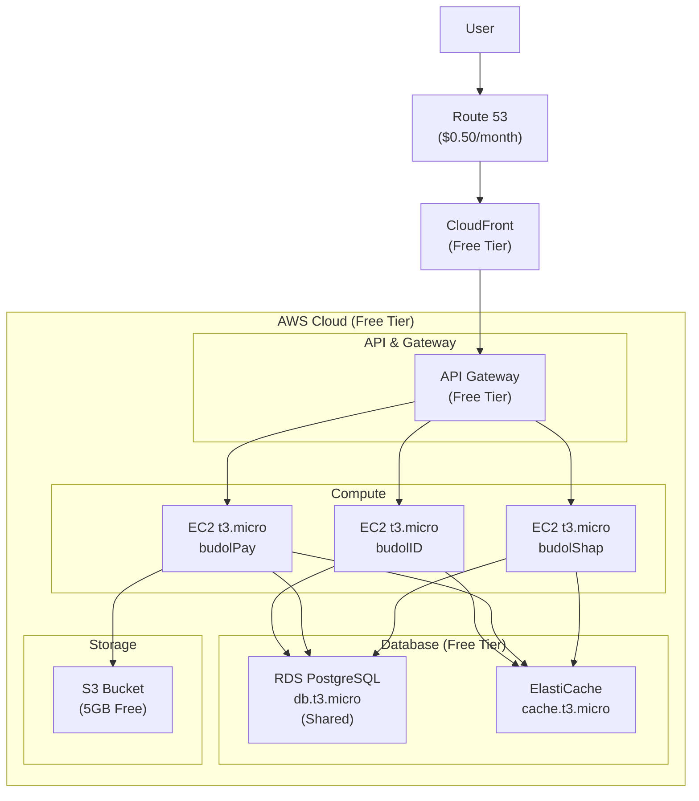
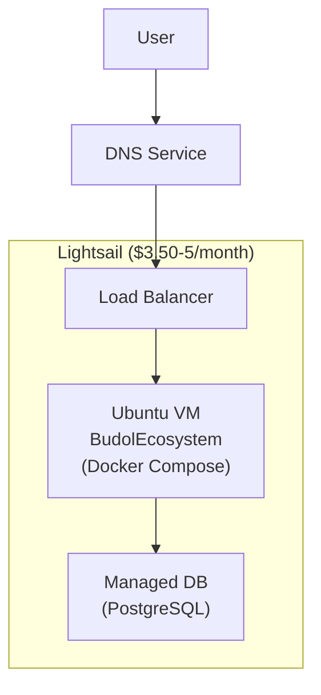

# budolEcosystem Implementation Plan
## Making Apps Independent with API Integration Capabilities (Parallel Approach)

**Document Version:** 2.0  
**Created:** 2026-03-06  
**Architecture Approach:** Independent microservices with shared integration APIs  
**Implementation Strategy:** Parallel workstreams for all apps

---

## Executive Summary

This document outlines a comprehensive plan to transform the budolEcosystem into a set of fully independent applications, each with its own database, while maintaining the ability to integrate with each other through well-defined APIs when needed.

This version uses a **parallel implementation approach** where work on all apps occurs simultaneously within each phase, rather than sequentially. This reduces overall timeline and allows teams to work in parallel.

### Current State
The budolEcosystem currently consists of:
- **budolID** (Port 8000): Single Sign-On (SSO) authentication service
- **budolAccounting** (Port 8005): Accounting and financial service
- **budolPay Gateway** (Port 8080): API Gateway for budolPay services
  - budolPay Auth (Port 8001)
  - budolPay Wallet (Port 8002)
  - budolPay Transaction (Port 8003)
  - budolPay Payment (Port 8004)
  - budolPay KYC (Port 8006)
  - budolPay Settlement (Port 8007)
- **budolShap**: E-commerce platform
- **budolLoan**: Loan management service

### Target State
Each application will be:
- **Independent**: Own its own database and run as a separate service
- **Integratable**: Expose well-documented APIs for cross-app communication
- **Deployable**: Can be deployed and scaled independently
- **Maintainable**: Clear boundaries and responsibilities

---

## Architecture Overview



---

## Phase 1: Foundation & Infrastructure Setup (Parallel)

**Timeline:** Week 1-2  
**Priority:** Critical  
**Goal:** Establish the infrastructure foundation for all independent services simultaneously

### Infrastructure Tasks (All Apps)

| Task | Description | Owner | Dependencies |
|------|-------------|-------|--------------|
| 1.1 | Document current database schema for each service | All Teams | None |
| 1.2 | Identify shared tables and dependencies across all services | All Teams | 1.1 |
| 1.3 | Create database migration strategy for all services | All Teams | 1.2 |
| 1.4 | Design isolated database architecture for all services | All Teams | 1.2 |

### Database Setup (Parallel - All Apps Simultaneously)

| Task | Description | Owner | Dependencies |
|------|-------------|-------|--------------|
| 1.5 | Set up isolated RDS PostgreSQL for budolID | Infrastructure | 1.3 |
| 1.6 | Set up isolated RDS PostgreSQL for budolPay | Infrastructure | 1.3 |
| 1.7 | Set up isolated RDS PostgreSQL for budolAccounting | Infrastructure | 1.3 |
| 1.8 | Set up isolated RDS PostgreSQL for budolShap | Infrastructure | 1.3 |
| 1.9 | Set up isolated RDS PostgreSQL for budolLoan | Infrastructure | 1.3 |

### Redis Setup (Parallel - All Apps Simultaneously)

| Task | Description | Owner | Dependencies |
|------|-------------|-------|--------------|
| 1.10 | Configure ElastiCache Redis for budolID | Infrastructure | 1.5 |
| 1.11 | Configure ElastiCache Redis for budolPay | Infrastructure | 1.6 |
| 1.12 | Configure ElastiCache Redis for budolAccounting | Infrastructure | 1.7 |
| 1.13 | Configure ElastiCache Redis for budolShap | Infrastructure | 1.8 |
| 1.14 | Configure ElastiCache Redis for budolLoan | Infrastructure | 1.9 |

### Network & CI/CD (Parallel - All Apps Simultaneously)

| Task | Description | Owner | Dependencies |
|------|-------------|-------|--------------|
| 1.15 | Update VPC configuration for service isolation | Network Team | None |
| 1.16 | Configure internal DNS for all services | Network Team | 1.15 |
| 1.17 | Configure security groups for inter-service communication | Network Team | 1.16 |
| 1.18 | Create CI/CD pipeline for budolID | DevOps | 1.5, 1.10 |
| 1.19 | Create CI/CD pipeline for budolPay | DevOps | 1.6, 1.11 |
| 1.20 | Create CI/CD pipeline for budolAccounting | DevOps | 1.7, 1.12 |
| 1.21 | Create CI/CD pipeline for budolShap | DevOps | 1.8, 1.13 |
| 1.22 | Create CI/CD pipeline for budolLoan | DevOps | 1.9, 1.14 |

**Deliverables:**
- [ ] Infrastructure architecture diagram
- [ ] Database connection strings for all 5 services
- [ ] VPC and network configuration
- [ ] CI/CD pipeline configurations for all services

---

## Phase 2: Database Independence (Parallel)

**Timeline:** Week 3-5  
**Priority:** High  
**Goal:** Migrate each service to use its own isolated database - ALL APPS SIMULTANEOUSLY

### Step 2.1: Schema Extraction (Parallel - All Apps)

| Task | Description | Owner | Dependencies |
|------|-------------|-------|--------------|
| 2.1.1 | Extract schema from shared DB - budolID | Data Team | Phase 1 Complete |
| 2.1.2 | Extract schema from shared DB - budolPay | Data Team | Phase 1 Complete |
| 2.1.3 | Extract schema from shared DB - budolAccounting | Data Team | Phase 1 Complete |
| 2.1.4 | Extract schema from shared DB - budolShap | Data Team | Phase 1 Complete |
| 2.1.5 | Extract schema from shared DB - budolLoan | Data Team | Phase 1 Complete |

### Step 2.2: Data Migration Scripts (Parallel - All Apps)

| Task | Description | Owner | Dependencies |
|------|-------------|-------|--------------|
| 2.2.1 | Create migration scripts - budolID | Data Team | 2.1.1 |
| 2.2.2 | Create migration scripts - budolPay | Data Team | 2.1.2 |
| 2.2.3 | Create migration scripts - budolAccounting | Data Team | 2.1.3 |
| 2.2.4 | Create migration scripts - budolShap | Data Team | 2.1.4 |
| 2.2.5 | Create migration scripts - budolLoan | Data Team | 2.1.5 |

### Step 2.3: Data Migration Execution (Parallel - All Apps)

| Task | Description | Owner | Dependencies |
|------|-------------|-------|--------------|
| 2.3.1 | Migrate data to budolID database | Data Team | 2.2.1 |
| 2.3.2 | Migrate data to budolPay database | Data Team | 2.2.2 |
| 2.3.3 | Migrate data to budolAccounting database | Data Team | 2.2.3 |
| 2.3.4 | Migrate data to budolShap database | Data Team | 2.2.4 |
| 2.3.5 | Migrate data to budolLoan database | Data Team | 2.2.5 |

### Step 2.4: Data Sync Framework (Parallel - All Apps)

| Task | Description | Owner | Dependencies |
|------|-------------|-------|--------------|
| 2.4.1 | Implement change tracking - budolID | Data Team | 2.3.1 |
| 2.4.2 | Implement change tracking - budolPay | Data Team | 2.3.2 |
| 2.4.3 | Implement change tracking - budolAccounting | Data Team | 2.3.3 |
| 2.4.4 | Implement change tracking - budolShap | Data Team | 2.3.4 |
| 2.4.5 | Implement change tracking - budolLoan | Data Team | 2.3.5 |
| 2.4.6 | Create sync adapters for shared data (all services) | Data Team | 2.4.1-5 |
| 2.4.7 | Set up event-driven data synchronization | Data Team | 2.4.6 |

**Deliverables:**
- [ ] Isolated databases for all 5 services
- [ ] Data migration scripts for all services
- [ ] Data sync framework
- [ ] Database backup strategies

---

## Phase 3: API Integration Framework (Parallel)

**Timeline:** Week 6-8  
**Priority:** High  
**Goal:** Create standardized APIs for inter-service communication - ALL APPS SIMULTANEOUSLY

### Step 3.1: API Standards (Parallel Work)

| Task | Description | Owner | Dependencies |
|------|-------------|-------|--------------|
| 3.1.1 | Define API versioning strategy | Architecture Team | Phase 2 Complete |
| 3.1.2 | Create API response standards | Architecture Team | 3.1.1 |
| 3.1.3 | Define error handling standards | Architecture Team | 3.1.2 |
| 3.1.4 | Document authentication for inter-service APIs | Architecture Team | 3.1.3 |

### Step 3.2: Service API Contracts (Parallel - All Apps)

| Task | Description | Owner | Dependencies |
|------|-------------|-------|--------------|
| 3.2.1 | Define budolID API contract | budolID Team | 3.1.4 |
| 3.2.2 | Define budolPay API contract | budolPay Team | 3.1.4 |
| 3.2.3 | Define budolAccounting API contract | Accounting Team | 3.1.4 |
| 3.2.4 | Define budolShap API contract | Shap Team | 3.1.4 |
| 3.2.5 | Define budolLoan API contract | Loan Team | 3.1.4 |

### Step 3.3: API Gateway Implementation (All Apps Connect)

| Task | Description | Owner | Dependencies |
|------|-------------|-------|--------------|
| 3.3.1 | Set up central API Gateway | Gateway Team | 3.2.1-5 |
| 3.3.2 | Configure routing rules for budolID | Gateway Team | 3.3.1 |
| 3.3.3 | Configure routing rules for budolPay | Gateway Team | 3.3.1 |
| 3.3.4 | Configure routing rules for budolAccounting | Gateway Team | 3.3.1 |
| 3.3.5 | Configure routing rules for budolShap | Gateway Team | 3.3.1 |
| 3.3.6 | Configure routing rules for budolLoan | Gateway Team | 3.3.1 |
| 3.3.7 | Implement rate limiting (all services) | Gateway Team | 3.3.2-6 |
| 3.3.8 | Set up request/response transformation | Gateway Team | 3.3.7 |

### Step 3.4: Service Discovery (All Apps)

| Task | Description | Owner | Dependencies |
|------|-------------|-------|--------------|
| 3.4.1 | Implement service registry | Infrastructure | 3.3.8 |
| 3.4.2 | Create health check endpoints (all services) | All Teams | 3.4.1 |
| 3.4.3 | Set up dynamic service discovery | Infrastructure | 3.4.2 |
| 3.4.4 | Configure load balancing | Infrastructure | 3.4.3 |

**Deliverables:**
- [ ] API standards documentation
- [ ] Service API contracts for all 5 services (OpenAPI/Swagger)
- [ ] Central API Gateway with all routes
- [ ] Service discovery system

---

## Phase 4: Service Refactoring (Parallel)

**Timeline:** Week 9-14  
**Priority:** High  
**Goal:** Refactor each service to be fully independent - ALL APPS SIMULTANEOUSLY

### Step 4.1: budolID Refactoring

| Task | Description | Dependencies |
|------|-------------|--------------|
| 4.1.1 | Update budolID to use isolated database | Phase 3 Complete |
| 4.1.2 | Implement user data export APIs | 4.1.1 |
| 4.1.3 | Add webhook support for user events | 4.1.2 |
| 4.1.4 | Create integration test suite | 4.1.3 |

### Step 4.2: budolPay Refactoring

| Task | Description | Dependencies |
|------|-------------|--------------|
| 4.2.1 | Update wallet service to use isolated DB | Phase 3 Complete |
| 4.2.2 | Update transaction service to use isolated DB | 4.2.1 |
| 4.2.3 | Update payment service to use isolated DB | 4.2.2 |
| 4.2.4 | Update settlement service to use isolated DB | 4.2.3 |
| 4.2.5 | Update KYC service to use isolated DB | 4.2.4 |
| 4.2.6 | Implement cross-service payment APIs | 4.2.5 |

### Step 4.3: budolAccounting Refactoring

| Task | Description | Dependencies |
|------|-------------|--------------|
| 4.3.1 | Update budolAccounting to use isolated DB | Phase 3 Complete |
| 4.3.2 | Implement accounting API endpoints | 4.3.1 |
| 4.3.3 | Add integration with budolPay | 4.3.2 |
| 4.3.4 | Create financial reporting APIs | 4.3.3 |

### Step 4.4: budolShap Refactoring

| Task | Description | Dependencies |
|------|-------------|--------------|
| 4.4.1 | Update budolShap to use isolated DB | Phase 3 Complete |
| 4.4.2 | Implement e-commerce API endpoints | 4.4.1 |
| 4.4.3 | Add integration with budolID for auth | 4.4.2 |
| 4.4.4 | Add integration with budolPay for payments | 4.4.3 |

### Step 4.5: budolLoan Refactoring

| Task | Description | Dependencies |
|------|-------------|--------------|
| 4.5.1 | Update budolLoan to use isolated DB | Phase 3 Complete |
| 4.5.2 | Implement loan management APIs | 4.5.1 |
| 4.5.3 | Add integration with budolPay | 4.5.2 |
| 4.5.4 | Add integration with budolAccounting | 4.5.3 |

**Note:** All 5 services are refactored in parallel during this phase. Each team works on their respective service simultaneously.

**Deliverables:**
- [ ] Refactored budolID service
- [ ] Refactored budolPay services
- [ ] Refactored budolAccounting service
- [ ] Refactored budolShap service
- [ ] Refactored budolLoan service

---

## Phase 5: Testing & Deployment (Parallel)

**Timeline:** Week 15-18  
**Priority:** High  
**Goal:** Ensure quality and smooth deployment - ALL APPS SIMULTANEOUSLY

### Step 5.1: Unit Testing (Parallel - All Apps)

| Task | Description | Owner | Dependencies |
|------|-------------|-------|--------------|
| 5.1.1 | Write unit tests for budolID | budolID Team | Phase 4 Complete |
| 5.1.2 | Write unit tests for budolPay | budolPay Team | Phase 4 Complete |
| 5.1.3 | Write unit tests for budolAccounting | Accounting Team | Phase 4 Complete |
| 5.1.4 | Write unit tests for budolShap | Shap Team | Phase 4 Complete |
| 5.1.5 | Write unit tests for budolLoan | Loan Team | Phase 4 Complete |

### Step 5.2: Integration Testing (Parallel - All Apps)

| Task | Description | Owner | Dependencies |
|------|-------------|-------|--------------|
| 5.2.1 | Create integration test framework | QA Team | 5.1.1-5 |
| 5.2.2 | Test budolID integration | budolID Team | 5.2.1 |
| 5.2.3 | Test budolPay integration | budolPay Team | 5.2.1 |
| 5.2.4 | Test budolAccounting integration | Accounting Team | 5.2.1 |
| 5.2.5 | Test budolShap integration | Shap Team | 5.2.1 |
| 5.2.6 | Test budolLoan integration | Loan Team | 5.2.1 |
| 5.2.7 | Test cross-service integration scenarios | All Teams | 5.2.2-6 |

### Step 5.3: Performance Testing (Parallel - All Apps)

| Task | Description | Owner | Dependencies |
|------|-------------|-------|--------------|
| 5.3.1 | Load test budolID | Performance Team | 5.2.7 |
| 5.3.2 | Load test budolPay | Performance Team | 5.2.7 |
| 5.3.3 | Load test budolAccounting | Performance Team | 5.2.7 |
| 5.3.4 | Load test budolShap | Performance Team | 5.2.7 |
| 5.3.5 | Load test budolLoan | Performance Team | 5.2.7 |
| 5.3.6 | Optimize based on results | All Teams | 5.3.1-5 |

### Step 5.4: Deployment (Parallel - All Apps)

| Task | Description | Owner | Dependencies |
|------|-------------|-------|--------------|
| 5.4.1 | Blue-green deployment - budolID | DevOps | 5.3.6 |
| 5.4.2 | Blue-green deployment - budolPay | DevOps | 5.3.6 |
| 5.4.3 | Blue-green deployment - budolAccounting | DevOps | 5.3.6 |
| 5.4.4 | Blue-green deployment - budolShap | DevOps | 5.3.6 |
| 5.4.5 | Blue-green deployment - budolLoan | DevOps | 5.3.6 |
| 5.4.6 | Canary releases for all services | DevOps | 5.4.1-5 |

**Deliverables:**
- [ ] Unit test coverage > 80% for all services
- [ ] Integration test suites for all services
- [ ] Performance test reports for all services
- [ ] Deployment runbooks for all services

---

## Phase 6: Documentation & Maintenance (Parallel)

**Timeline:** Week 19-20  
**Priority:** Medium  
**Goal:** Ensure long-term maintainability - ALL APPS SIMULTANEOUSLY

### Step 6.1: API Documentation (Parallel - All Apps)

| Task | Description | Owner | Dependencies |
|------|-------------|-------|--------------|
| 6.1.1 | Generate OpenAPI specs - budolID | budolID Team | Phase 5 Complete |
| 6.1.2 | Generate OpenAPI specs - budolPay | budolPay Team | Phase 5 Complete |
| 6.1.3 | Generate OpenAPI specs - budolAccounting | Accounting Team | Phase 5 Complete |
| 6.1.4 | Generate OpenAPI specs - budolShap | Shap Team | Phase 5 Complete |
| 6.1.5 | Generate OpenAPI specs - budolLoan | Loan Team | Phase 5 Complete |
| 6.1.6 | Create unified API documentation portal | Docs Team | 6.1.1-5 |
| 6.1.7 | Document integration guides | Docs Team | 6.1.6 |

### Step 6.2: Architecture Documentation (Parallel - All Apps)

| Task | Description | Owner | Dependencies |
|------|-------------|-------|--------------|
| 6.2.1 | Update system architecture diagrams | Architecture | 6.1.7 |
| 6.2.2 | Document database schemas (all) | Data Team | 6.2.1 |
| 6.2.3 | Create operational runbooks | All Teams | 6.2.2 |
| 6.2.4 | Document troubleshooting guides | All Teams | 6.2.3 |

### Step 6.3: Monitoring & Observability (Parallel - All Apps)

| Task | Description | Owner | Dependencies |
|------|-------------|-------|--------------|
| 6.3.1 | Set up centralized logging (all services) | DevOps | 6.2.4 |
| 6.3.2 | Configure distributed tracing | DevOps | 6.3.1 |
| 6.3.3 | Set up alerts and notifications | DevOps | 6.3.2 |
| 6.3.4 | Create dashboards for all services | DevOps | 6.3.3 |

### Step 6.4: Maintenance Procedures (Parallel - All Apps)

| Task | Description | Dependencies |
|------|-------------|--------------|
| 6.4.1 | Define update procedures (all services) | 6.3.4 |
| 6.4.2 | Create backup and recovery procedures | 6.4.1 |
| 6.4.3 | Define security patching process | 6.4.2 |
| 6.4.4 | Set up regular audit schedule | 6.4.3 |

**Deliverables:**
- [ ] Complete API documentation for all services
- [ ] Architecture documentation
- [ ] Monitoring dashboards for all services
- [ ] Maintenance runbooks for all services

---

## Parallel Execution Timeline



### Team Structure for Parallel Execution

| Team | Services Responsible |
|------|---------------------|
| Team 1 (budolID) | budolID - SSO/Authentication |
| Team 2 (budolPay) | All budolPay services |
| Team 3 (Accounting) | budolAccounting |
| Team 4 (Shap) | budolShap - E-commerce |
| Team 5 (Loan) | budolLoan |
| Team 6 (Platform) | Infrastructure, CI/CD, API Gateway |
| Team 7 (QA) | Testing across all services |
| Team 8 (Docs) | Documentation |

---

## Integration Patterns

### Pattern 1: Synchronous API Calls



### Pattern 2: Event-Driven Integration



### Pattern 3: Data Replication



---

## Risk Assessment and Mitigation

| Risk | Impact | Mitigation Strategy |
|------|--------|---------------------|
| Data loss during migration | High | Comprehensive backup strategy, staged migration |
| Service downtime | High | Blue-green deployment, canary releases |
| Integration failures | Medium | Circuit breakers, retry mechanisms |
| Performance degradation | Medium | Performance testing, caching strategies |
| Security vulnerabilities | High | Regular security audits, dependency updates |
| Resource contention | Medium | Parallel team coordination, clear ownership |

---

## Success Metrics

- [ ] All 5 services can be deployed independently
- [ ] Database isolation achieved for all services
- [ ] API integration framework operational for all services
- [ ] 80%+ test coverage achieved for all services
- [ ] All services have complete documentation
- [ ] Monitoring and alerting operational for all services
- [ ] Deployment automation in place for all services

---

## Appendix: Service Dependencies Matrix

| Service | Depends On | Provides To |
|---------|------------|-------------|
| budolID | None | Auth for all services |
| budolPay | budolID | Payment services |
| budolAccounting | budolPay, budolID | Financial reporting |
| budolShap | budolID, budolPay | E-commerce platform |
| budolLoan | budolPay, budolAccounting | Loan management |

---

## Appendix: Quick Reference - Phase Steps Summary

### Phase 1 Steps (14 tasks)
1. Document schemas → 2. Identify dependencies → 3. Migration strategy → 4. DB architecture → 5-9. DB setup (5 services) → 10-14. Redis + Network + CI/CD (all parallel)

### Phase 2 Steps (27 tasks)
2.1.1-5: Schema extraction (5 services parallel) → 2.2.1-5: Migration scripts (5 parallel) → 2.3.1-5: Migration execution (5 parallel) → 2.4.1-7: Sync framework

### Phase 3 Steps (18 tasks)
3.1.1-4: Standards → 3.2.1-5: API contracts (5 parallel) → 3.3.1-8: Gateway → 3.4.1-4: Discovery

### Phase 4 Steps (22 tasks)
4.1.1-4: budolID → 4.2.1-6: budolPay → 4.3.1-4: Accounting → 4.4.1-4: Shap → 4.5.1-4: Loan

### Phase 5 Steps (23 tasks)
5.1.1-5: Unit tests (5 parallel) → 5.2.1-7: Integration tests → 5.3.1-6: Performance → 5.4.1-6: Deployment

### Phase 6 Steps (18 tasks)
6.1.1-7: API docs → 6.2.1-4: Architecture docs → 6.3.1-4: Monitoring → 6.4.1-4: Maintenance

**Total: 122 tasks across 6 phases**

---

## Appendix: AWS Free Tier Deployment Plan

This section provides a cost-effective deployment strategy using AWS Free Tier and low-cost options suitable for development, staging, and small production workloads.

### AWS Free Tier Overview

AWS Free Tier includes:
- **AWS Lambda**: 1 million free requests/month
- **Amazon EC2**: 750 hours/month (t2.micro or t3.micro)
- **Amazon RDS**: 750 hours/month (Single-AZ db.t2.micro or db.t3.micro)
- **Amazon DynamoDB**: 25 GB/month
- **Amazon S3**: 5 GB/month
- **Amazon API Gateway**: 1 million API calls/month
- **AWS Fargate**: Optional (pay-as-you-go)
- **Amazon ElastiCache**: 750 hours/month (cache.t2.micro or cache.t3.micro)
- **Amazon SNS**: 100 SMS notifications/month (varies by region)

---

### Free Tier Architecture



---

### Free Tier Deployment Steps

#### Phase A1: AWS Account Setup (Week 1)

| Task | Description | Cost | Dependencies |
|------|-------------|------|--------------|
| A1.1 | Create AWS account | $0 | None |
| A1.2 | Set up billing alerts | $0 | A1.1 |
| A1.3 | Enable AWS Free Tier monitoring | $0 | A1.2 |
| A1.4 | Create IAM user for deployment | $0 | A1.1 |

#### Phase A2: Network & Compute Setup (Week 1-2)

| Task | Description | Cost | Dependencies |
|------|-------------|------|--------------|
| A2.1 | Create VPC | $0 | A1.4 |
| A2.2 | Create subnets (public/private) | $0 | A2.1 |
| A2.3 | Set up Internet Gateway | $0 | A2.2 |
| A2.4 | Configure security groups | $0 | A2.3 |
| A2.5 | Request EC2 Spot instances or use t3.micro | $0-10/month | A2.4 |

#### Phase A3: Database Setup (Free Tier) (Week 2)

| Task | Description | Cost | Dependencies |
|------|-------------|------|--------------|
| A3.1 | Launch RDS PostgreSQL (db.t3.micro) | $0 (Free Tier) | A2.4 |
| A3.2 | Configure DB subnet group | $0 | A3.1 |
| A3.3 | Set up ElastiCache Redis (cache.t3.micro) | $0 (Free Tier) | A3.1 |
| A3.4 | Configure parameter groups | $0 | A3.3 |

#### Phase A4: Application Deployment (Week 2-3)

| Task | Description | Cost | Dependencies |
|------|-------------|------|--------------|
| A4.1 | Create EC2 instances for each service | $0-20/month total | A2.5 |
| A4.2 | Install Docker on EC2 instances | $0 | A4.1 |
| A4.3 | Deploy budolID container | $0 | A4.2 |
| A4.4 | Deploy budolPay containers | $0 | A4.2 |
| A4.5 | Deploy budolShap | $0 | A4.2 |
| A4.6 | Configure Nginx reverse proxy | $0 | A4.3-5 |

#### Phase A5: API Gateway & DNS (Week 3)

| Task | Description | Cost | Dependencies |
|------|-------------|------|--------------|
| A5.1 | Set up API Gateway | $0 (Free Tier) | A4.6 |
| A5.2 | Configure custom domain | $12/year | A5.1 |
| A5.3 | Set up Route 53 DNS | $0.50/month | A5.2 |
| A5.4 | Configure SSL/TLS (ACM - Free) | $0 | A5.3 |

#### Phase A6: Storage & Media (Week 3)

| Task | Description | Cost | Dependencies |
|------|-------------|------|--------------|
| A6.1 | Create S3 bucket | $0 (5GB Free) | None |
| A6.2 | Configure S3 for media storage | $0 | A6.1 |
| A6.3 | Set up CloudFront distribution | $0 (Free Tier) | A6.2 |

---

### Cost Estimation (Free Tier)

| Service | Free Tier Allowance | Cost After Free Tier | Monthly Cost |
|---------|---------------------|---------------------|--------------|
| EC2 (3x t3.micro) | 750 hours total | $0.0104/hour | ~$15-20/month |
| RDS PostgreSQL | 750 hours | $0.017/hour | ~$12-15/month |
| ElastiCache Redis | 750 hours | $0.017/hour | ~$12-15/month |
| API Gateway | 1M requests | $3.50/million | $0-3.50 |
| S3 | 5 GB | $0.023/GB | $0-1 |
| Route 53 | - | - | $0.50/month |
| CloudFront | 1 TB | $0.085/GB | $0-5 |
| **Total** | | | **$40-60/month** |

---

### Optimizing for Free Tier

| Strategy | Description | Savings |
|----------|-------------|----------|
| Use Single EC2 | Run all services on 1 t3.micro (limited) | ~$15/month |
| Use Spot Instances | Bid for spare capacity | 60-90% off |
| Use Lightsail | Simplified $3.50/month VPS | ~$10/month |
| Use Lambda | Serverless (cold start consideration) | Free for 1M requests |
| Use Amplify | Static site hosting | Free tier available |
| Use Container Apps | Azure Container Apps | Free tier available |

---

### Alternative: AWS Lightsail (Simplest & Cheapest)

For the simplest free-tier deployment:



| Service | Cost | Specification |
|---------|------|---------------|
| Lightsail VM | $5/month | 1 vCPU, 512MB RAM, 30GB SSD |
| Managed Database | $15/month | PostgreSQL 10GB |
| DNS + SSL | $0 | Route 53 + ACM |
| **Total** | **$20/month** | |

---

### Docker Compose for Free Tier Deployment

Create a unified `docker-compose.yml` for single VM deployment:

```yaml
version: '3.8'
services:
  # API Gateway
  nginx:
    image: nginx:latest
    ports:
      - "80:80"
      - "443:443"
    volumes:
      - ./nginx.conf:/etc/nginx/nginx.conf:ro
    depends_on:
      - budolid
      - budolpay-gateway
      - budolshap

  # budolID - SSO
  budolid:
    image: budolecosystem/budolid:latest
    environment:
      - PORT=8000
      - DATABASE_URL=postgres://user:pass@db:5432/budolid
    depends_on:
      - db

  # budolPay Gateway
  budolpay-gateway:
    image: budolecosystem/budolpay-gateway:latest
    ports:
      - "8080:8080"
    environment:
      - DATABASE_URL=postgres://user:pass@db:5432/budolpay

  # budolShap
  budolshap:
    image: budolecosystem/budolshap:latest
    ports:
      - "3000:3000"
    environment:
      - DATABASE_URL=postgres://user:pass@db:5432/budolshap

  # Database
  db:
    image: postgres:15
    environment:
      - POSTGRES_USER=user
      - POSTGRES_PASSWORD=pass
      - POSTGRES_MULTIPLE_DATABASES=budolid,budolpay,budolshap,budolaccounting,budolloan
    volumes:
      - pgdata:/var/lib/postgresql/data

  # Redis
  redis:
    image: redis:7-alpine
    command: redis-server --requirepass yourredispass
    volumes:
      - redisdata:/data

volumes:
  pgdata:
  redisdata:
```

---

### Deployment Commands (Free Tier)

```bash
# 1. Launch EC2 t3.micro (Free Tier eligible)
aws ec2 run-instances \
  --image-id ami-0c55b159cbfafe1f0 \
  --instance-type t3.micro \
  --key-name your-key-pair \
  --security-group-ids sg-xxxxxxxx \
  --subnet-id subnet-xxxxxxxx

# 2. Connect to EC2 and install Docker
ssh -i your-key.pem ec2-user@your-instance-ip
sudo yum update -y
sudo yum install -y docker
sudo service docker start
sudo usermod -a -G docker ec2-user

# 3. Clone and deploy
git clone your-repo
cd budolEcosystem
docker-compose up -d

# 4. Set up RDS (via AWS Console)
# Use db.t3.micro for Free Tier

# 5. Configure environment variables
cp .env.example .env
# Edit .env with RDS and Redis endpoints

# 6. Run database migrations
docker-compose exec budolid npx prisma migrate deploy

# 7. Verify deployment
curl http://localhost/health
```

---

### Monitoring Free Tier Usage

| Tool | Purpose | Cost |
|------|---------|------|
| CloudWatch Free Tier | Basic metrics | $0 |
| AWS Budgets | Cost alerts | $0 |
| CloudWatch Logs | 5GB free | $0 |
| AWS Trusted Advisor | Cost checks | $0 |

Set up billing alert:
```bash
# Create billing alert via CloudWatch
aws cloudwatch put-metric-alarm \
  --alarm-name estimated-charges-alarm \
  --alarm-description "Alert when charges exceed $30" \
  --metric-name EstimatedCharges \
  --namespace AWS/Billing \
  --statistic Maximum \
  --period 86400 \
  --evaluation-periods 1 \
  --threshold 30 \
  --comparison-operator GreaterThanThreshold \
  --treat-missing-data notBreaching
```

---

### Scaling from Free Tier

When ready to scale beyond Free Tier:

| Stage | Action | Estimated Cost |
|-------|--------|----------------|
| Stage 1 | Add separate EC2 per service | +$15-20/month each |
| Stage 2 | Move to RDS dedicated instance | +$50-100/month |
| Stage 3 | Add ElastiCache cluster | +$30-50/month |
| Stage 4 | Enable Auto Scaling | Variable |
| Stage 5 | Add Multi-AZ | 2x current cost |

---

### Troubleshooting Free Tier

| Issue | Solution |
|-------|----------|
| Free Tier exhausted | Check CloudWatch billing dashboard |
| EC2 instance limit | Request limit increase or use Spot |
| RDS storage full | Enable auto-scaling or upgrade |
| CPU credits depleted | Use larger instance or optimize |

---

*End of AWS Free Tier Deployment Plan*

---

*End of Document - Version 2.0 (Parallel Approach with AWS Free Tier)*
